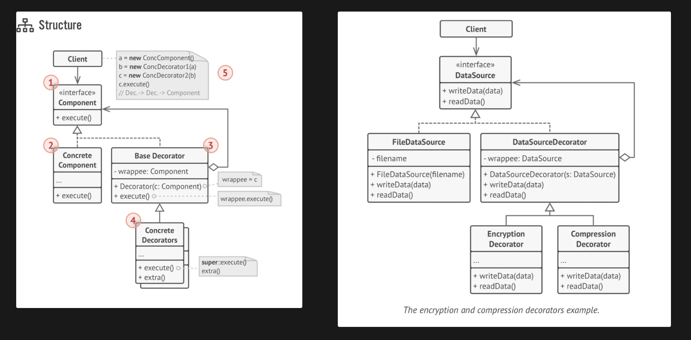

## Decorator (Wrapper) Design Pattern:
    - lets you attach new behaviors to objects by placing these objects inside special wrapper objects that contain 
      the behaviors

```text
Terminology: Component, ConcreteComponent, BaseDecorator, ConcreteDecorators

Why Decorator?

    Assume you are developing a Software for Pizza Shop. Assume we have a single type of Pizza which is Margherita.
Now, the customers can order this pizza and customize the toppings on top of it. Assume, we have the following toppings:
1. Cheese
2. Mushroom
3. Veggies
4. Chicken

Now, you may think that it is ideal to create these toppings as derived classes of Margherita class. So, we will be 
having 4 sub classes. 

Did we solve the problem?
    Not really. With these derived classes, the customer can order Cheese Pizza, Mushroom Pizza, Veggies Pizza and
Chicken Pizza. But, he will not get a Veggie Pizza with Cheese and Mushrooms on it. 

What if a customer wants (Cheese + Mushroom) or (Cheese + Veggies) or (Cheese + Chicken) or ......?
    How many such cases are possible? 
        It turns out that we have 4 choice of toppings, so we have 2^4 combinations i.e. 16 types in total:
        1. Cheese     5. CS + M    8. M + V    10. V + CK   11. CS + M + V   14. M + V + CK
        2. Mushroom   6. CS + V    9. M + CK                12. CS + M + CK  15. CS + M + V + CK
        3. Veggies    7. CS + CK                            13. CS + V + CK  16. No Toppings
        4. Chicken    
        
    To support all these toppings, do you think it is ideal to create these many sub classes?
        No. As the number of toppings grow in the future it is not at all a good idea to deal it this way.
        
    This problem is known as "CLASS EXPLOSION PROBLEM".
    
Why are we not able to solve it with Inheritance?
    With inheritance the behavior doesn't change dynamically at run time. The derived class will do, what is
meant for.

So, we should always prefer Composition over Inheritance if we want to change the behavior dynamically.

DECORATOR DESIGN PATTERN SOLVES THE CLASS EXPLOSION PROBLEM

Extending a class is the first thing that comes to mind when you need to alter an object’s behavior. However, 
inheritance has several serious caveats that you need to be aware of.

• Inheritance is static. You can’t alter the behavior of an existing object at runtime. You can only replace the whole 
  object with another one that’s created from a different subclass.
• Subclasses can have just one parent class. In most languages, inheritance doesn’t let a class inherit behaviors of 
  multiple classes at the same time.
  
One of the ways to overcome these caveats is by using Composition instead of Inheritance. With composition one 
object has a reference to another and delegates it some work, whereas with inheritance, the object itself is able to 
do that work, inheriting the behavior from its superclass. With composition, you can easily substitute the linked 
“helper” object with another, changing the behavior of the container at runtime. An object can use the behavior of 
various classes, having references to multiple objects and delegating them all kinds of work. Composition is the key 
principle behind many design patterns, including the Decorator.
```

### Decorator Structure


### Applicability
    - Use the Decorator pattern when you need to be able to assign extra behaviors to objects at runtime without 
      breaking the code that uses these objects.
    - Use the pattern when it’s awkward or not possible to extend an object’s behavior using inheritance.

### Implementation
1. Make sure your business domain can be represented as a primary component with multiple optional layers over it.
2. Figure out what methods are common to both the primary component and the optional layers. Create a component 
   interface and declare those methods there.
3. Create a concrete component class and define the base behavior in it.
4. Create a base decorator class. It should have a field for storing a reference to a wrapped object. The field should 
   be declared with the component interface type to allow linking to concrete components as well as decorators. The 
   base decorator must delegate all work to the wrapped object.
5. Make sure all classes implement the component interface.
6. Create concrete decorators by extending them from the base decorator. A concrete decorator must execute its behavior 
   before or after the call to the parent method (which always delegates to the wrapped object).
7. The client code must be responsible for creating decorators and composing them in the way the client needs.

## Pros and Cons
    v You can extend an object’s behavior without making a new subclass.
    v You can add or remove responsibilities from an object at runtime.
    v You can combine several behaviors by wrapping an object into multiple decorators.
    v Single Responsibility Principle. You can divide a monolithic class that implements many possible variants of 
      behavior into several smaller classes.
    x It’s hard to remove a specific wrapper from the wrappers stack.
    x It’s hard to implement a decorator in such a way that its behavior doesn’t depend on the order in the decorators stack.
    x The initial configuration code of layers might look pretty ugly.