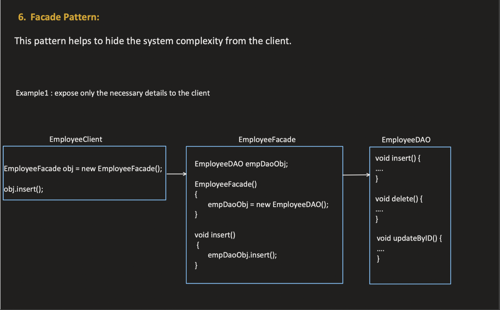
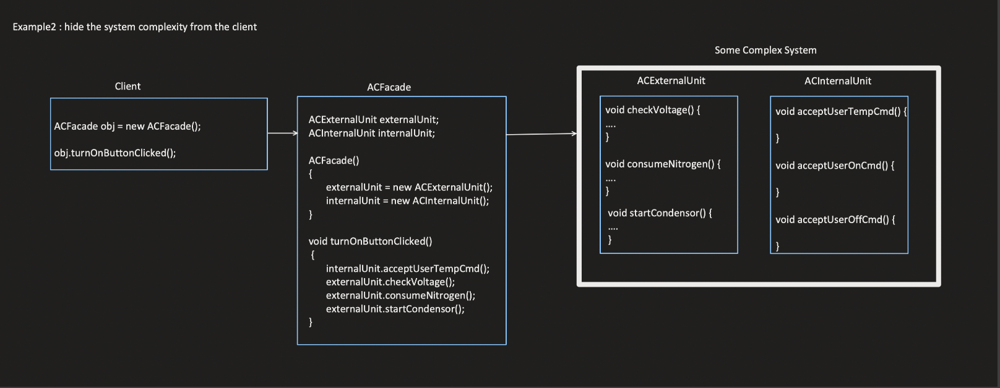
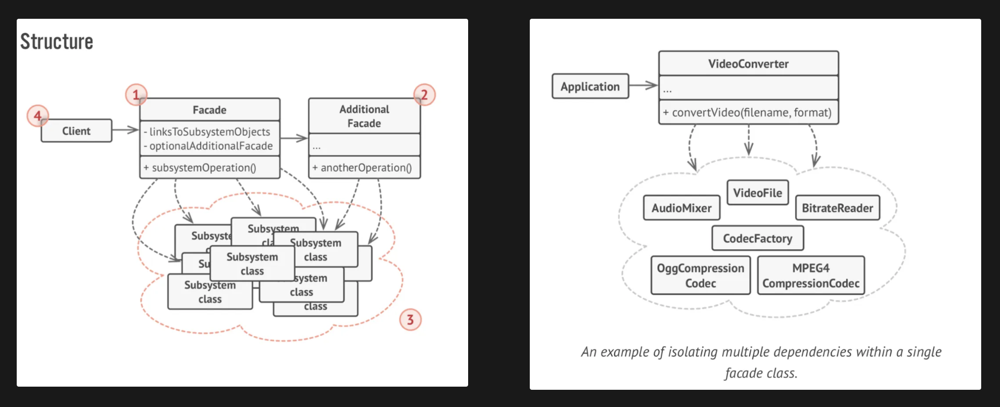

### Facade Design Pattern:
    - It is used to hide the system complexity from client
    - It is also used to expose only necessary details to the client
    - Simple and widely used

### Explanation:
```text
        Client                  *******FACADE LAYER*******              *********** COMPLEX SYSTEM ************
                     ========>  Accelerator (Speed Increases)   ======> Internally infuses more fuel into cylinders which will
         Car                                                            push pistons fastly and thus speed increases
                     ========>  Brake (Speed Decreases)         ======> Internally reduces fuel into cylinders and 
                                                                         reduces pistons movment & speed decreases
         
        It is just enough to tell the client to press accelerator to increase speed and press brake to decrease speed.
        It is rather unnecessary to directly tell the client to infuse more fuel into cylinders to increase speed and
        viceversa to decrease speed
        
        Accelerator and Brake fall into Facade layer here as they hide the complexity of the underlying system. 
```

### Note:
    - It is the responsibility of the facade to instantiate(manage lifecycle of) the classes of the complex system.
    - It is not always mandatory for clients to only interact with Facade
    - Clients can also choose to interact with Complex System directly but it has few limitations

### UseCase - 1: (Expose only necessary details to the client)


### UseCase - 2: (Hide the system complexity from client)


### Example:
```text
        
        public class ProductDAO {                                               public class Payment {
            
            public Product getProduct(int productId) {                              public boolean makePayment() {
                // get Product based on product id and return                           // initiate payment and return true if success
                return new Product();                                                   return true;
            }                                                                        }
        }                                                                        }
    
        public class Invoice {                                                   public class SendNotification {
            
            public void generateInvoice() {                                           public void sendNotification() {
                // this will generate the invoice                                           // this will send notification to customer on mobile
            }                                                                         }
        }                                                                        }                                                  
        
        public class OrderFacade {
            
            private ProductDAO productDAO;
            private Invoice invoice;
            private Payment payment;
            private SendNotification notification;
            
            public OrderFacade() {
                productDAO = new ProductDAO();
                invoice = new Invoice();
                payment = new Payment();
                notification = new SendNotification();
            }
            
            public void createOrder() {
                Product product = productDAO.getProduct(121);
                payment.makePayment();
                invoice.generateInvoice();
                notification.sendNotification();
            }
        }
        
        public class Client {
            
            private OrderFacade orderFacade;
            
            public Client() {
                orderFacade = new OrderFacade();
            }
            
            public void placeOrder() {
                orderFacade.createOrder();
            }
        }
        
            See how easier it would be to the client to directly interact with OrderFacade rather than interact with
        the ProductDAO, Payment, Invoice, SendNotification classes directly. 
        
        What if the client had interacted with these classes directly? Will this hurt anything?
        Client interaction is as follows:
        
        Product product = productDAO.getProduct(121);
        payment.makePayment();
        invoice.generateInvoice();
        notification.sendNotification();
        
            Yes. You get the following disadvantages if the client interacts with these classes directly:
            
            1. Client needs to be changed whenever order creation logic changes. 
               Assume we have 1 more new class to be integrated with the flow i.e. logging the order creation event to RedShift.
               Now, the client needs to be updated as follows:
               
               Product product = productDAO.getProduct(121);
               payment.makePayment();
               redshiftLogger.logOrder(orderId);
               invoice.generateInvoice();
               notification.sendNotification();
               
               If we had OrderFacade in place, then we can just change the OrderFacade class and no change is required on the client side.
            
            2. Client needs to be changed whenever there is a change in any of ProductDAO, Payment, Invoice, SendNotification classes.
               Assume generateInvoice() method's return type has been changed from void to Integer and it returns Invoice ID, then the
               client needs to be changed accordingly and capture the invoice id which is again an overhead.
               
               If we had OrderFacade in place, then we can just change the OrderFacade class and no change is required on the client side.
```

### Note:
    - A Facade can also interact with a Facade and that Facade can interact with Complex System. Facade can interact with any number
      of facades and complex systems to simplify the interface for the client.

### Structure and Example:
