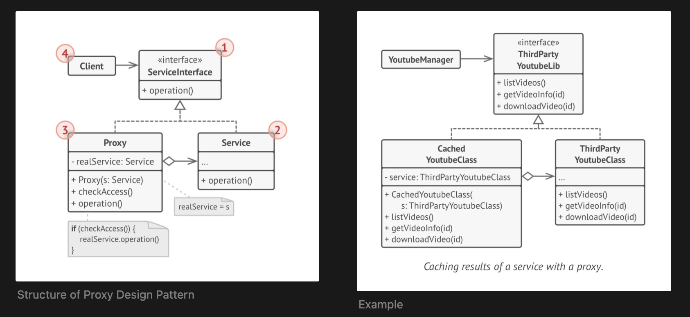

## Proxy Design Pattern
    - provide placeholder for another object
    - controls access to original object
    - allowing you to perform something either before or after the request gets through to the original object

```text
Terminology: Proxy, Service(Real Object), Service Interface

Proxy:        
                                  Proxy
            Client  ---------------------------------> Real Object
                 (access restrictions - protection proxy)
                        (caching - caching proxy)
                        (logging - logging proxy)
                    (Preprocessing and Postprocessing)
             (add details to request before sending to Real Object and 
             strip details after receiving response from Real Object - remote proxy)
                            
```

### Proxy Structure


### Implementation:
    1. If there’s no pre-existing service interface, create one to make proxy and service objects interchangeable. 
    Extracting the interface from the service class isn’t always possible, because you’d need to change all of the 
    service’s clients to use that interface. Plan B is to make the proxy a subclass of the service class, and this way
    it’ll inherit the interface of the service.

    2. Create the proxy class. It should have a field for storing a ref- erence to the service. Usually, proxies 
    create and manage the whole life cycle of their servers. In rare occasions, a service is passed to the proxy 
    via a constructor by the client.

    3. Implement the proxy methods according to their purposes. In most cases, after doing some work, the proxy 
    should delegate the work to the service object.

    4. Consider introducing a creation method that decides whether the client gets a proxy or a real service. 
    This can be a sim- ple static method in the proxy class or a full-blown factory method.

    5. Consider implementing lazy initialization for the service object.

### Pros and Cons:
    v You can control the service object without clients knowing about it.
    v You can manage the lifecycle of the service object when clients don’t care about it.
    v The proxy works even if the service object isn’t ready or is not available.
    v Open/Closed Principle. You can introduce new proxies without changing the service or clients.
    x The code may become more complicated since you need to introduce a lot of new classes.
    x The response from the service might get delayed.